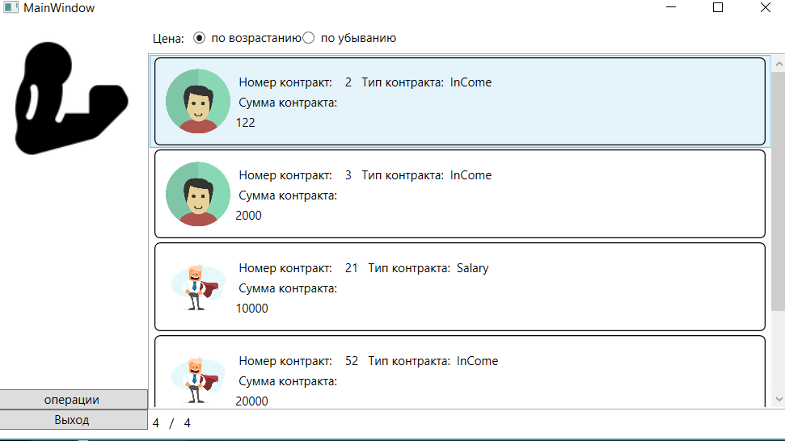

<table style="width: 100%;">
  <tr>
    <td style="text-align: center; border: none;"> 
        Министерство образования и науки РФ <br/>
        ГБПОУ РМЭ "Йошкар-Олинский Технологический колледж 
    </td>
  </tr>
  <tr>
    <td style="text-align: center; border: none; height: 45em;">
        <h2>
            Курсовой проект <br/>
            "Проектирование и разработка информационных систем" <br/>
            для группы И-31
        <h2>
    </td>
  </tr>
  <tr>
    <td style="text-align: right; border: none; height: 20em;">
        <div style="float: right;" align="left">
            <b>Разработал</b>: <br/>
            Пенкин Сергей Андреевич <br/>
            <b>Проверил</b>: <br/>
            Колесников Евгений Иванович
        </div>
    </td>
  </tr>
  <tr>
    <td style="text-align: center; border: none; height: 1em;">
        г.Йошкар-Ола, 2021
    </td>
  </tr>
</table>

<div style="page-break-after: always;"></div>

https://github.com/serejapenkin/Kursovaya

# Содержание

* [Теоретическая часть](#Теоретическая-часть)
* [Практическая часть, разработка бд](#Практическая-часть.-Разработка-БД)
* [Практическая часть, разработка кода ИС](#Практическая-часть.-Разработка-кода-ИС)

# Теоретическая-часть
## Диаграммы

### Предметная область  Фитнес-центр.Подсистема для управления компанией.


### Диаграмма ER:


# Практическая часть
## Программирование С#


### Приложение было разработанно в Visual Studio, пример работы программы:
### Главное окно:

#### Прмер кода разметки страницы:


```xml
<Window x:Class="KursPekin.MainWindow"
        xmlns="http://schemas.microsoft.com/winfx/2006/xaml/presentation"
        xmlns:x="http://schemas.microsoft.com/winfx/2006/xaml"
        xmlns:d="http://schemas.microsoft.com/expression/blend/2008"
        xmlns:mc="http://schemas.openxmlformats.org/markup-compatibility/2006"
        xmlns:local="clr-namespace:KursPekin"
        mc:Ignorable="d"
        Title="MainWindow" Height="450" Width="800">
    <Grid>
        <Grid.ColumnDefinitions>
            <ColumnDefinition Width="150"/>
            <ColumnDefinition Width="*"/>
        </Grid.ColumnDefinitions>
        <Image 
        Margin="5"
        Source="./img/triceps_fitness_icon_181746.ico" 
        VerticalAlignment="Top"/>

        <StackPanel Grid.Column="0"
                    VerticalAlignment="Bottom">
           
            <Button Content="операции"
                    x:Name="ContrantShow"
                    Click="ContrantShow_Click"
                    Margin="0 0 0 0"
                    
                   ></Button>
            <Button Content="Выход"
                    x:Name="ExitButton"
                    Margin="0 0 0 10"
                    Click="ExitButton_Click"
                   ></Button>


        </StackPanel>


        <Grid Grid.Column="1">
            <Grid.RowDefinitions>
                <RowDefinition Height="30"/>
                <RowDefinition Height="1*"/>
                <RowDefinition Height="30"/>
            </Grid.RowDefinitions>
            <StackPanel 
    Orientation="Horizontal" 
    VerticalAlignment="Center"
                Grid.Row="0">
                <Label Content="Цена: "/>
                <RadioButton 
        GroupName="Price"
        Tag="1"
        Content="по возрастанию" 
        IsChecked="True" 
        Checked="RadioButton_Checked"
        VerticalContentAlignment="Center"/>
                <RadioButton 
        GroupName="Price" 
        Tag="2"
        Content="по убыванию" 
        Checked="RadioButton_Checked"
        VerticalContentAlignment="Center"/>


            </StackPanel>


            <ListView 
            Grid.Column="1"
            Grid.Row="1"
            ItemsSource="{Binding ContracList}"
            x:Name="ProductListView">

                <ListView.ItemTemplate>


                    <DataTemplate>
                        <!-- рисуем вокруг элемента границу с загругленными углами -->
                        <Border 
                BorderThickness="1" 
                BorderBrush="Black" 
                CornerRadius="5">
                            <!-- основная "сетка" из 3-х столбцов: картинка, содержимое, цена -->
                            <Grid 
                    Margin="10" 
                    HorizontalAlignment="Stretch">
                                <Grid.ColumnDefinitions>
                                    <ColumnDefinition Width="64"/>
                                    <ColumnDefinition Width="*"/>
                                    <ColumnDefinition Width="100"/>
                                </Grid.ColumnDefinitions>


                                <Image
                        Width="64" 
                        Height="64"
                        Source="{Binding Path=ImagePreview}" />

                                
                               
                              


                                <!-- для содержимого рисуем вложенную сетку -->
                                <Grid Grid.Column="1" Margin="5">
                                    <Grid.RowDefinitions>
                                        <RowDefinition Height="20"/>
                                        <RowDefinition Height="20"/>
                                        <RowDefinition Height="*"/>
                                    </Grid.RowDefinitions>

                                    <StackPanel
                            Orientation="Horizontal">
                                        <TextBlock 
                                Text=" Номер контракт:    "/>
                                        <TextBlock 
                                Text="{Binding NumberContract }"/>
                                        <TextBlock 
                                Text="   Тип контракта:  "/>
                                        <TextBlock 
                                Text="{Binding ContractType.Title}"/>
                                       
                                        
                                    </StackPanel>
                                    <TextBlock 
                                        Grid.Row="1"
                                Text=" Сумма контракта:   "/>
                                    <TextBlock 
                                        Grid.Row="2"
                                            Text="{Binding CostString}"
                                />

                                </Grid>

                            </Grid>
                        </Border>
                    </DataTemplate>

                </ListView.ItemTemplate>
                <ListView.ItemContainerStyle>
                    <Style 
            TargetType="ListViewItem">
                        
                        <Setter 
                Property="HorizontalContentAlignment"
                Value="Stretch" />
                    </Style>
                </ListView.ItemContainerStyle>
            </ListView>
            <StackPanel Grid.Row="2" Orientation="Horizontal">
                <Label Content="{Binding FilteredServicesCount}"></Label>
                <Label >/</Label>
                <Label Content="{Binding ServicesCount}"/>
            </StackPanel>
        </Grid>

    </Grid>
</Window>

#### Пример Логики главной страницы:

```cs
namespace KursPekin
{
    public partial class Userman
    {
        public string FullName
        {
            get
            {
                return FirstName + " " + LastName + " " + Patronomyc;
            }
        }
        public Uri ImagePreviewClient
        {
            get
            {
                var imageName = System.IO.Path.Combine(Environment.CurrentDirectory, photo ?? "");
                return System.IO.File.Exists(imageName) ? new Uri(imageName) : new Uri("pack://application:,,,/Фото сотрудника/picture.jpg");
            }
        }
    }
    public partial class Contract
    {
        public Boolean MinSalary
        {
            get
            {
                    return prosess == "";
                
            }
        }
        public double DiscountFloat
        {
            get
            {
                return Convert.ToSingle(Summa);
            }
        }
        public string CostString
        {
            get
            {
                // тут должно быть понятно - преобразование в строку с нужной точностью
                return Summa.ToString("#.##");
            }
        }
        public Uri ImagePreview
        {
            get
            {
                var imageName = System.IO.Path.Combine(Environment.CurrentDirectory, Avatar ?? "");
                return System.IO.File.Exists(imageName) ? new Uri(imageName) : new Uri("pack://application:,,,/img/picture.jpg");
            }
        }
    }
    /// <summary>
    /// Логика взаимодействия для MainWindow.xaml
    /// </summary>
    public partial class MainWindow : Window, INotifyPropertyChanged
    {
        
        public MainWindow()
        {
            this.DataContext = this;
            ContracList = Core.DB.Contract.ToList();
            InitializeComponent();
        }
        private List<Contract> _ContractList;

        public List<Contract> ContracList {
            get
            {
                if (SortPriceAscending)
                    return _ContractList
                        .OrderBy(item =>(item.Summa))
                        .ToList();
                else
                    return _ContractList
                        .OrderByDescending(item => (item.Summa))
                        .ToList();
            }
            
            set
            {
                 _ContractList = value;
                if (PropertyChanged != null)
                {
                    PropertyChanged(this, new PropertyChangedEventArgs("ContracList"));
                    PropertyChanged(this, new PropertyChangedEventArgs("ServicesCount"));
                    PropertyChanged(this, new PropertyChangedEventArgs("FilteredServicesCount"));
                }
            }
        }
        private Boolean _SortPriceAscending = true;

        public event PropertyChangedEventHandler PropertyChanged;

        public Boolean SortPriceAscending
        {
            get { return _SortPriceAscending; }
            set
            {
                _SortPriceAscending = value;
                if (PropertyChanged != null)
                {
                    PropertyChanged(this, new PropertyChangedEventArgs("ContracList"));
                    PropertyChanged(this, new PropertyChangedEventArgs("ServicesCount"));
                    PropertyChanged(this, new PropertyChangedEventArgs("FilteredServicesCount"));
                }
            }
        }
        private void RadioButton_Checked(object sender, RoutedEventArgs e)
        {
            SortPriceAscending = (sender as RadioButton).Tag.ToString() == "1";
        }
        public int ServicesCount
        {
            get
            {
                return _ContractList.Count;
            }

        }
        public int FilteredServicesCount
        {
            get
            {
                return ContracList.Count;
            }
        }

        private void ContrantShow_Click(object sender, RoutedEventArgs e)
        {
            
            var OpenContractShow = new windows.ContractProsess();
           // OpenContractShow.ShowDialog();
            if ((bool)OpenContractShow.ShowDialog())
            {
                // при успешном завершении не забываем перерисовать список услуг
                PropertyChanged(this, new PropertyChangedEventArgs("ContracList"));
                PropertyChanged(this, new PropertyChangedEventArgs("ServicesCount"));
                PropertyChanged(this, new PropertyChangedEventArgs("FilteredServicesCount"));
                // и еще счетчики - их добавьте сами
            }
        }

        private void ExitButton_Click(object sender, RoutedEventArgs e)
        {
            Application.Current.Shutdown();
        }
    }
}

```


#### Прмер кода разметки страницы редактирования заказов:
```xml
    Title="ContractWindow" Height="600" Width="800">
    <Grid>
        <Grid.ColumnDefinitions>
            <ColumnDefinition Width="auto"/>
            <ColumnDefinition  Width="*"/>
        </Grid.ColumnDefinitions>

        <Image 
                Grid.Column="0"
            VerticalAlignment="Top"
           MaxHeight="200" 
           MaxWidth="200" 
           Source="{Binding CurrentService.ImagePreview}" />

       
        <StackPanel Grid.Column="1" Margin="5 60">
            <Label Content="Лицо"/>
            <ComboBox
                HorizontalAlignment="left"
                ItemsSource="{Binding UsermanList}"
                SelectedItem="{Binding CurrentService.Userman}">
                <ComboBox.ItemTemplate>
                    <DataTemplate>
                        <Label Content="{Binding FullName}" />
                    </DataTemplate>
                </ComboBox.ItemTemplate>
            </ComboBox>

            <Label Content="Сумма контракта"/>
            <TextBox Text="{Binding CurrentService.Summa}"/>
            <Label Content="Операций"/>
            <TextBox Text="{Binding CurrentService.prosess}"/>
            <Label Content="Дата"/>
            <TextBox Text="{Binding CurrentService.ContractTime}"/>
            <Label Content="Номер котнтракта"/>
            <TextBox Text="{Binding CurrentService.NumberContract}"/>
            <Label Content="Тип"/>
            <ComboBox
                HorizontalAlignment="left"
                ItemsSource="{Binding ContractTypeList}"
                SelectedItem="{Binding CurrentService.ContractType}">
                <ComboBox.ItemTemplate>
                    <DataTemplate>
                        <Label Content="{Binding Title}" />
                    </DataTemplate>
                </ComboBox.ItemTemplate>
            </ComboBox>


            <Button Width="100" Margin="5" HorizontalAlignment="Left" Click="GetImageButton_Click">Выбрать Картинку</Button>
            <Button Width="100" Margin="5" HorizontalAlignment="Left" Click="SaveButton_Click">Сохранить</Button>
        </StackPanel>
    </Grid>
    ```
#### Пример Логики страницы редактирования заказов:

```cs
namespace KursPekin.windows
{
    /// <summary>
    /// Логика взаимодействия для ContractWindow.xaml
    /// </summary>
    public partial class ContractWindow : Window, INotifyPropertyChanged
    {
        public List<Userman> UsermanList { get; set; }

        public List<ContractType> ContractTypeList { get; set; }
        public ContractWindow(Contract contract)
        {
            
            InitializeComponent();
            this.DataContext = this;
            CurrentService = contract;
            UsermanList = Core.DB.Userman.ToList();
            ContractTypeList = Core.DB.ContractType.ToList();
        }
        public Contract CurrentService { get; set; }
        public string WindowName
        {
            get
            {
                return CurrentService.id == 0 ? "Новая услуга" : "Редоктирование улсгуи";
            }
        }

        public event PropertyChangedEventHandler PropertyChanged;

        private void GetImageButton_Click(object sender, RoutedEventArgs e)
        {
            OpenFileDialog GetImageDialog = new OpenFileDialog();
            // задаем фильтр для выбираемых файлов
            // до символа "|" идет произвольный текст, а после него шаблоны файлов раздеренные точкой с запятой
            GetImageDialog.Filter = "Файлы изображений: (*.png, *.jpg)|*.png;*.jpg";
            // чтобы не искать по всему диску задаем начальный каталог
            GetImageDialog.InitialDirectory = Environment.CurrentDirectory;
            if (GetImageDialog.ShowDialog() == true)
            {
                // перед присвоением пути к картинке обрезаем начало строки, т.к. диалог возвращает полный путь
                // (тут конечно еще надо проверить есть ли в начале Environment.CurrentDirectory)
                CurrentService.Avatar = GetImageDialog.FileName.Substring(Environment.CurrentDirectory.Length + 1);
                if (PropertyChanged != null)
                {
                    PropertyChanged(this, new PropertyChangedEventArgs("CurrentService"));
                }
            }
        }
        private void SaveButton_Click(object sender, RoutedEventArgs e)
        {
            if (CurrentService.Summa <= 0 || CurrentService.Summa > 1000000)
            {
                MessageBox.Show("Контракт не может быть меньше или равно нулю или больше 1000000");
                return;
            }

           


            // если запись новая, то добавляем ее в список
            if (CurrentService.id == 0)
                Core.DB.Contract.Add(CurrentService);

            // сохранение в БД
            try
            {
                Core.DB.SaveChanges();
            }
            catch
            {
            }
            DialogResult = true;
        }
        public string NewProduct
        {
            get
            {
                if (CurrentService.id == 0) return "collapsed";
                return "visible";


            }
        }
    }
}

```
# Тестировние
## Создание библиотеки классов и Юнит тестов
### Библиотека классов
```cs
namespace MihKursTest
{
    public class Class1
    {
        public int DiscountPrice(int price)
        {
            int sum = ((price / 100) * 15) * price;
            return sum;
        }
        public string SalaryNotNull(int salary)
        {
            if (Summa <= 0 || Summa > 100000)
            {
                return "цена не может быть меньше или равана нулю  или больше 100000";
            }
            else
                return "Все правильно";
         }
         

    }
}

```
### Юнит тесты (Сделал токлько 2)

```cs
namespace UniTestKurs
{
    [TestClass]
    public class UnitTest1
    {
        static Class1 disk__price;
        [ClassInitialize]
        static public void Init(TestContext tc)
        {
            disk__price = new Class1();
        }
        [TestMethod]
        public void DiscountPrice()
        {
            Assert.AreEqual(disk__price.DiscountPrice(100), 1500);
        }
        [TestMethod]
        public void SummaNotNull()
        {
            Assert.AreEqual(disk__price.SalaryNotNull(-2), "цена не может быть меньше или равана нулю  или больше 100000");
        }
        
    }
}
